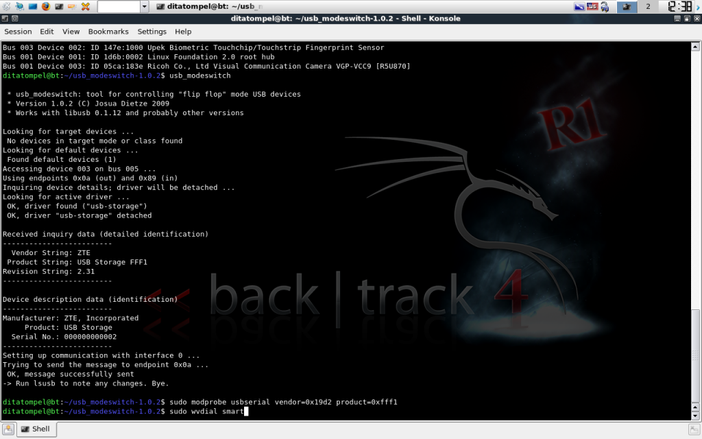

When this tutorial was created, I used the **BackTrack** distribution. And it should work on other **Linux** distributions too.

First, you need to [download `usb_modeswitch`](https://www.draisberghof.de/usb_modeswitch/#download). If you already have an internet connection (with **Wi-Fi**, for example), you can simply run the `wget` command:

```bash
wget https://www.draisberghof.de/usb_modeswitch/usb_modeswitch-1.0.2.tar.bz2
```

After the download process is complete, extract `usb_modeswitch-1.0.2.tar.bz2`, which you just downloaded.

```bash
tar -xjf usb_modeswitch-1.0.2.tar.bz2
```

Go to the `usb_modeswitch-1.0.2` directory and install:

```bash
cd usb_modeswitch-1.0.2; sudo make install
```

and you will get output similar like this:

```plain
[sudo] password for ditatompel:
mkdir -p /usr/sbin
install ./usb_modeswitch /usr/sbin
mkdir -p /etc
install ./usb_modeswitch.conf /etc
```

It can be seen that two files have been installed: `usb_modeswitch` and `usb_modeswitch.conf`. Edit `usb_modeswitch.conf`, which is located in the `/etc` directory.

```bash
sudo nano /etc/usb_modeswitch.conf
```

Add the following configuration, which is similar to **ZTE AC2710** (**EVDO**) modem configurations by **Wasim Baig**:

```plain
#########################################################
## ZTE AC2726i (EVDO)
DefaultVendor= 0x19d2
DefaultProduct= 0xfff5
TargetVendor= 0x19d2
TargetProduct= 0xfff1
MessageContent= "5553424312345678c00000008000069f010000000000000000000000000000"
```

Then, open the `wvdial` configuration in `/etc/wvdial.conf` and edit the configuration file:

> _\* I recommend always backing up your configuration before making changes._

```bash
sudo nano /etc/wvdial.conf
```

Add the following configuration:

```plain
[Dialer smart]
Init1 = ATZ
Init2 = ATQ0 V1 E1 S0=0 &C1 &D2 +FCLASS=0
Modem Type = USB Modem
ISDN = 0
New PPPD = yes
Phone = #777
Modem = /dev/ttyUSB0
Username = smart
Password = smart
FlowControl = CRTSCTS
Carrier Check = No
Baud = 9600
```

The `usb_modeswitch` and `wvdial` configuration has been completed.

Run `usb_modeswitch` from the terminal to change the USB modem product from `fff5` to `fff1`.

```bash
usb_modeswitch
```

Then, the next step we need to do is detect the **product ID** of the modem we are using:

```bash
sudo modprobe usbserial vendor=0x19d2 product=0xfff1
```

Finally, run the `wvdial` command:

```bash
sudo wvdial smart
```


